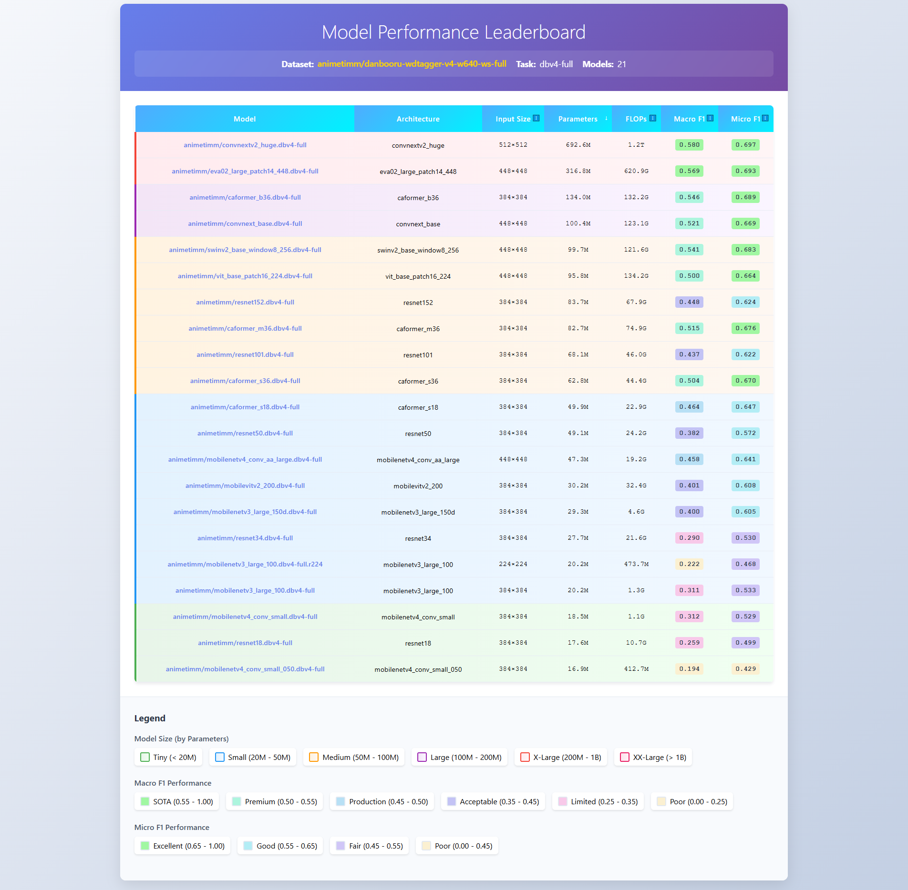

# ComfyUI-animetimm

[中文介绍](README_zh.md)

ComfyUI custom node for tagging anime images using models from [animetimm](https://huggingface.co/animetimm).

## Features

- Performs anime image tag prediction using various TIMM models from [animetimm](https://huggingface.co/animetimm)
- Supports classification of general tags, character tags, artist tags, and rating tags
- Supports batch image processing
  

## Installation

### Recommended

- Install via [ComfyUI-Manager](https://github.com/ltdrdata/ComfyUI-Manager).

### Manual

- Navigate to `ComfyUI/custom_nodes` in your terminal (cmd).
- Clone the repository into the `custom_nodes` directory using the following command:
  ```
  git clone https://github.com/MakkiShizu/ComfyUI-animetimm
  cd ComfyUI-animetimm
  ```
- Install the dependencies in your Python environment.
  - For Windows portable version, run the following command in `ComfyUI\custom_nodes\ComfyUI-animetimm`:
    ```
    ..\..\..\python_embeded\python.exe -m pip install -r requirements.txt
    ```
  - If using venv or conda, activate your Python environment first, then run:
    ```
    pip install -r requirements.txt
    ```

## Usage

### Anime TIMM Classifier

The node provides the following parameters:

- `image`: Input image
- `threshold`: Confidence threshold (default 0.35), only tags with confidence above this value will be output
- `model_repo`: Select model repository (default animetimm/caformer_s36.dbv4-full)
- `include_general`: Whether to include general tags (default True)
- `include_character`: Whether to include character tags (default True)
- `include_artist`: Whether to include artist tags (default False)
- `include_rating`: Whether to include rating tags (default True)

### Output

- `tags`: Comma-separated tag string
- `confidence_scores`: Corresponding confidence score list
- `raw_output`: Raw output with categories and confidence scores
- `general_tags`: General tags
- `character_tags`: Character tags
- `artist_tags`: Artist tags
- `rating_tags`: Rating tags

## Notes

- Model files need to be downloaded on first run, which may take some time
- Models will be cached in the `ComfyUI/models/animetimm` directory after first use
- GPU is recommended for inference to achieve better performance
- Different models have trade-offs between accuracy and speed, choose according to your needs
- Some models (e.g., `eva02_large_patch14_448.dbv4-full`) require larger VRAM

## Performance

Ranklist: [dbv4-full-ranklist](https://huggingface.co/spaces/animetimm/dbv4-full-ranklist)


## Troubleshooting

### Model download fails

The official repository is publicly accessible, but you must log in and accept the terms to access its files and content. If download from the official repository fails, the node will automatically try to download from a backup repository.
